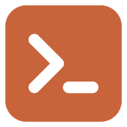
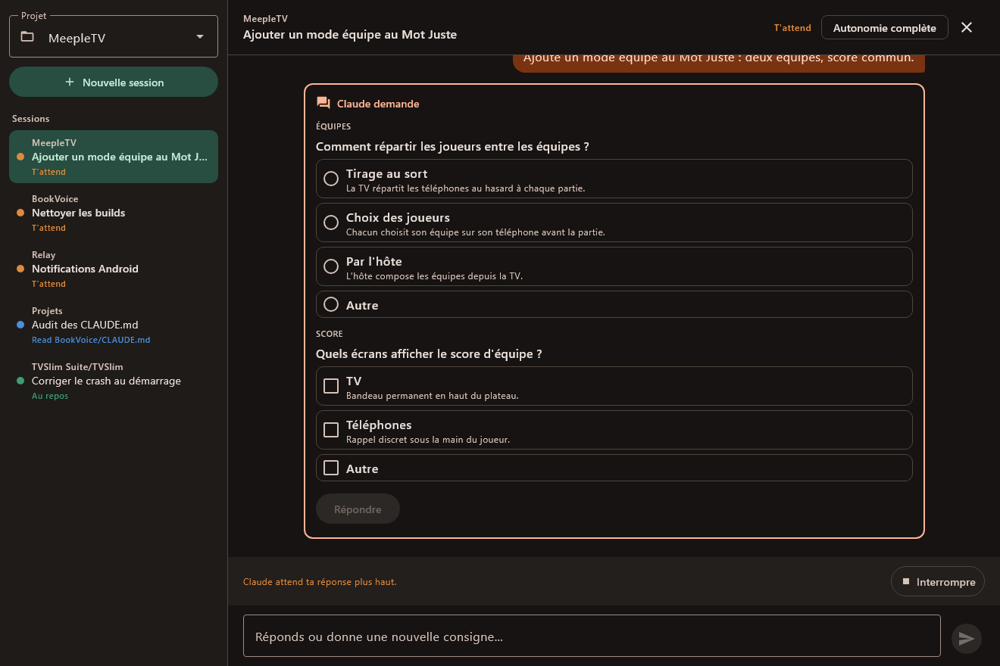
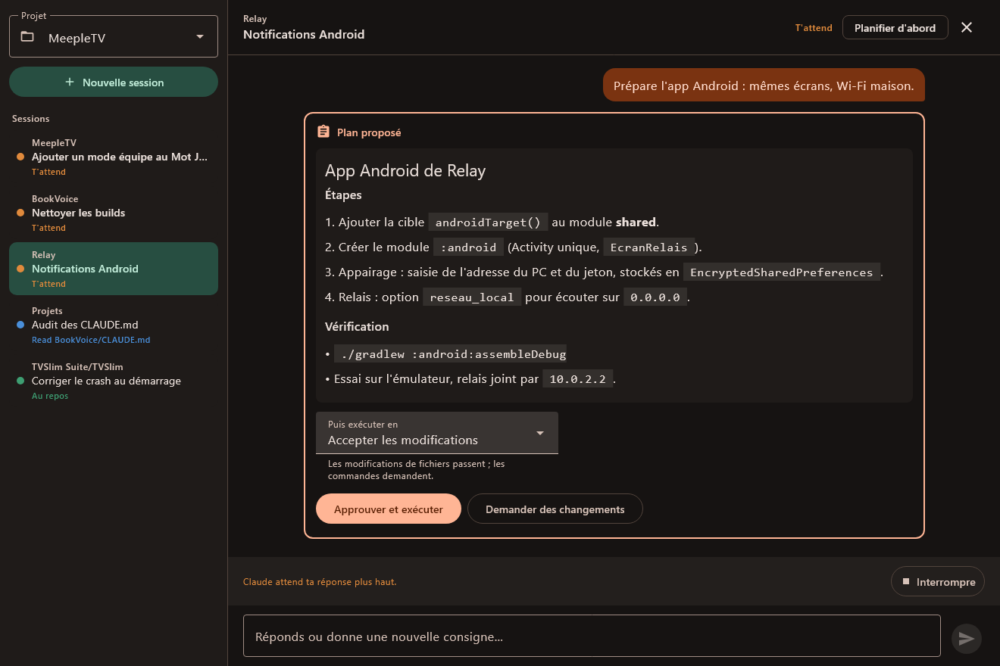

# Relay

**Piloter Claude Code sans surveiller un terminal.** Vous écrivez ce qu'il faut faire ; Claude
travaille dans votre projet ; seul ce qui vous concerne revient — ses questions à choix, les
demandes de permission, son plan, et le compte rendu de fin de tour. Tout le reste (lectures,
modifications, réflexion) se résume à une ligne d'état.

Plusieurs sessions tournent côte à côte, chacune dans son projet. Elles vivent dans un petit service
d'arrière-plan : fermer la fenêtre n'arrête rien, et une notification Windows prévient quand Claude
a besoin de vous.

[English version](README.md)



## Ce qui vous revient

| Carte | Quand | Ce que vous pouvez faire |
|---|---|---|
| **Question** | Claude appelle `AskUserQuestion` | choisir une ou plusieurs options, ou écrire votre réponse |
| **Permission** | un outil demande l'accord (hors *Autonomie complète*) | autoriser, ou refuser avec un motif transmis à Claude |
| **Plan** | en mode *Planifier d'abord*, Claude soumet son plan | approuver et choisir comment l'exécuter, ou demander des changements |
| **Compte rendu** | un tour se termine | le lire (Markdown), puis répondre ou donner la consigne suivante |

**Pièces jointes**, comme dans le terminal : collez une capture ou des fichiers copiés avec
**Ctrl+V**, déposez des fichiers sur la fenêtre, ou passez par le trombone. Les images sont montrées
directement à Claude (réduites à ce qu'il lit) ; les autres fichiers — journaux, PDF, code — lui sont
remis pour qu'il les lise.

Quatre modes, modifiables à tout moment : *Demander avant d'agir*, *Accepter les modifications*,
*Planifier d'abord*, *Autonomie complète*. Les questions vous parviennent même en *Autonomie
complète*.



## Fonctionnement

```
Relay (app Windows) ──WebSocket──▶ service relais (Python) ──Claude Agent SDK──▶ Claude Code
```

- **`relais/`** — le service. Il fait tourner chaque session par le
  [Claude Agent SDK](https://docs.claude.com/en/docs/agent-sdk/overview), transforme questions,
  permissions et plans en événements, et attend votre réponse. Il n'écoute que sur `127.0.0.1`.
- **`client/`** — Compose Multiplatform. `shared` porte le protocole, la connexion, le modèle de vue
  et les écrans ; `windows` ajoute la fenêtre, l'icône de la zone de notification, et démarre le
  service au besoin. Un client Android (Wi-Fi de la maison) est prévu et reprendra `shared`.

## Prérequis

- Windows 10 ou 11
- Python 3.12+ dans le `PATH`
- [Claude Code](https://docs.claude.com/en/docs/claude-code/overview), connecté — Relay utilise
  **votre propre** authentification Claude Code (ou `ANTHROPIC_API_KEY` si elle est définie). Votre
  usage reste soumis aux conditions d'Anthropic.
- Pour compiler : JDK 21 (celui d'Android Studio convient)

## Compiler et lancer

```bash
pip install -r relais/requirements.txt

cd client
./gradlew :windows:run                  # lancer
./gradlew :windows:createDistributable  # app autonome dans windows/build/compose/binaries/main/app/
./gradlew :windows:packageMsi           # installateur par utilisateur
```

L'app démarre le service toute seule. Le chemin de `relais/` est gravé à la compilation : recompiler
si le dossier déménage.

## Configuration

Au premier démarrage, le service écrit `%APPDATA%\Relay\config.json` :

| Clé | Défaut | Rôle |
|---|---|---|
| `racine` | votre dossier personnel | **Claude ne travaille que sous ce dossier** ; ses sous-dossiers sont proposés comme projets. À faire pointer sur votre dossier de projets. |
| `port` | `8787` | port local |
| `jeton` | tiré au sort | jeton exigé de chaque client |
| `reseau_local` | `false` | écouter sur le réseau local (pour le futur client Android) |

Journal : `%APPDATA%\Relay\relais.log`.

## Sécurité

- Le service n'écoute que sur `127.0.0.1` tant que `reseau_local` est désactivé.
- Chaque connexion exige le jeton, comparé en temps constant.
- Toute requête portant un en-tête `Origin` est refusée : aucune page web ne peut piloter Claude par
  `ws://127.0.0.1`.
- Une session ne s'ouvre que sous `racine`.

Gardez en tête ce que veut dire *Autonomie complète* : Claude modifie vos fichiers et lance des
commandes sans rien demander.

## Tests

```bash
cd relais && python -m pytest -q          # service, avec un faux Claude
cd client && ./gradlew :shared:jvmTest    # protocole
./gradlew :shared:jvmTest -Pplanche=1     # rend chaque écran dans shared/build/captures/
```

## Licence

[Apache 2.0](LICENSE). Relay est un projet indépendant, sans lien avec Anthropic. Claude et Claude
Code sont des marques d'Anthropic.
